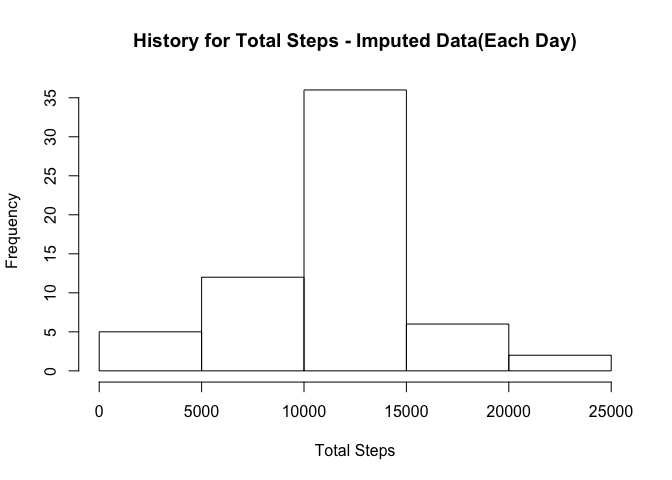

# Reproducible Research: Peer Assessment 1

Note - The program assumes the activity data set to be present in current working directory

### 1. Code for reading in the dataset and/or processing the data


```r
library(dplyr)
```

```
## 
## Attaching package: 'dplyr'
```

```
## The following objects are masked from 'package:stats':
## 
##     filter, lag
```

```
## The following objects are masked from 'package:base':
## 
##     intersect, setdiff, setequal, union
```

```r
library(lattice)
activity_data <- read.csv("activity.csv",header=TRUE,sep=",")
activity_data_sum <- aggregate(steps ~ date, data=activity_data,FUN=sum)
```

### 2. Histogram of the total number of steps taken each day

```r
hist(activity_data_sum$steps,main="History for Total Steps(Each Day)",xlab="Total Steps",ylab="Frequency" )
```

<!-- -->

### 3. Mean and median number of steps taken each day

Mean Steps

```r
mean(activity_data_sum$steps)
```

```
## [1] 10766.19
```

Median Steps

```r
median(activity_data_sum$steps)
```

```
## [1] 10765
```

### 4. Time series plot of the average number of steps taken


```r
activity_data_avg <- aggregate(steps ~ interval, data=activity_data,FUN=mean)

plot(activity_data_avg$interval,activity_data_avg$steps,type="l",xlab="Time Interval",ylab="Average Steps",main="Average Steps by Interval")
```

<!-- -->

### 5. The 5-minute interval that, on average, contains the maximum number of steps


```r
activity_data_avg[activity_data_avg$steps == max(activity_data_avg$steps),1]
```

```
## [1] 835
```

### 6. Code to describe and show a strategy for imputing missing data

Number of rows in the data file

```r
nrow(activity_data)
```

```
## [1] 17568
```

Number of rows with missing values 

```r
nrow(activity_data[is.na(activity_data$steps),])
```

```
## [1] 2304
```

Create 2 sets of data (one with rows having values and other with NAs)

```r
activity_data_full_records <- activity_data[complete.cases(activity_data),]
activity_data_na_records <- activity_data[is.na(activity_data$steps),]
```

Merge the missing data with average values for each interval

```r
activity_data_na_merged <- merge(activity_data_na_records,activity_data_avg, by.x = "interval", by.y = "interval", all.x = TRUE)
activity_data_na_filled <- select(activity_data_na_merged,4,3,1)
names(activity_data_na_filled) = c("steps","date","interval")
```

Create final imputed data

```r
activity_data_imputed <- rbind(activity_data_full_records, activity_data_na_filled)
```

Number of rows in final imputed data

```r
nrow(activity_data_imputed)
```

```
## [1] 17568
```

Number of rows in final imputed data with missing values

```r
nrow(activity_data_imputed[is.na(activity_data_imputed$steps),])
```

```
## [1] 0
```

Compute average steps per day for imputed data

```r
activity_data_imputed_sum <- aggregate(steps ~ date, data= activity_data_imputed,FUN=sum)
```


### 7. Histogram of the total number of steps taken each day after missing values are imputed


```r
hist(activity_data_imputed_sum $steps,main="History for Total Steps - Imputed Data(Each Day)",xlab="Total Steps",ylab="Frequency" )
```

<!-- -->

### 8. Panel plot comparing the average number of steps taken per 5-minute interval across weekdays and weekends

Create a new column in the dataframe for classifing records classifying "Weekday" and "Weekend"

```r
activity_data_imputed$date <- as.Date(activity_data_imputed$date)

 activity_data_imputed["day"] = ifelse(weekdays(activity_data_imputed $date) == "Sunday" | weekdays(activity_data_imputed $date) == "Saturday","Weekday","Weekend")
```

Create a panel plot for "weekend" and "weekday" for average steps by interval

```r
 activity_data_imputed_avg = aggregate(steps ~ interval + day, data= activity_data_imputed,FUN=mean)

xyplot(steps ~ interval | day,  activity_data_imputed_avg,type="l",xlab="Interval",ylab="Steps",layout=c(1,2),main="Average Steps by interval for Imputed Data")
```

<!-- -->
